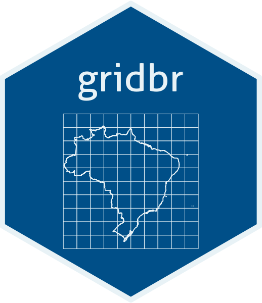
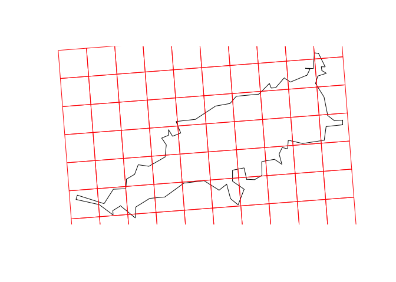

<!-- README.md is generated from README.Rmd. Please edit that file -->

# gridbr: easy access to the Brazilian statistical grid with R <a href='https://lucunha.com/gridbr'></a>

<!-- badges: start -->

[](https://github.com/luisfelipebr/gridbr/actions/workflows/R-CMD-check.yaml)
<!-- badges: end -->

**The goal of ‘gridbr’ is to provide easy access to the [Brazilian
Statistical
Grid](https://mapasinterativos.ibge.gov.br/grade/default.html)**,
published by the Brazilian Institute of Geography and Statistics (IBGE).
It builds upon the development made in the project [IBGE Statistical
Grid in Compact Representation](https://github.com/osm-codes/BR_IBGE).

## Installation

You can install the development version of *gridbr* from this GitHub
repository with `devtools`:

``` r
devtools::install_github("luisfelipebr/gridbr")
```

## Usage

### Setup

``` r
library(gridbr)
library(sf)
```

In the following examples, the Brazilian archipelago [Fernando de
Noronha](https://en.wikipedia.org/wiki/Fernando_de_Noronha) is used as
aoi. It can be download with the package
[geobr](https://ipeagit.github.io/geobr/) by using its municipality
code.

``` r
library(geobr)
```

``` r
aoi <- read_municipality(2605459, showProgress = FALSE)
```

``` r
plot(st_geometry(aoi))
```


### gridbr_download(input, cellsize)

**`gridbr_download()`** is the main function available in the package.
It builds the original statistical grid published by IBGE and merge it
with downloaded 2010 population census data. The user must provide the
area of interest (aoi) as a geospatial
[sf](https://r-spatial.github.io/sf/index.html) object.

Two arguments are mandatory: `input` and `cellsize`.

``` r
aoi_grid <- gridbr_download(input = aoi, 
                            cellsize = "1KM")
```

``` r
head(aoi_grid)
#> Simple feature collection with 6 features and 5 fields
#> Geometry type: POLYGON
#> Dimension:     XY
#> Bounding box:  xmin: -32.48123 ymin: -3.890802 xmax: -32.46804 ymax: -3.836282
#> Geodetic CRS:  SIRGAS 2000
#>               id MASC FEM POP DOM_OCU                       geometry
#> 1 1KME7376N10816    0   0   0       0 POLYGON ((-32.47706 -3.8908...
#> 2 1KME7376N10817    0   0   0       0 POLYGON ((-32.47775 -3.8818...
#> 3 1KME7376N10818    0   0   0       0 POLYGON ((-32.47845 -3.8728...
#> 4 1KME7376N10819    0   0   0       0 POLYGON ((-32.47914 -3.8638...
#> 5 1KME7376N10820    0   0   0       0 POLYGON ((-32.47984 -3.8549...
#> 6 1KME7376N10821    0   0   0       0 POLYGON ((-32.48054 -3.8459...
```

``` r
plot(st_geometry(aoi))
plot(st_geometry(aoi_grid), add = TRUE, border = "red")
```



The original Brazilian statistical grid was made available at the
following cell sizes: ‘500KM’, ‘100KM’, ‘50KM’, ‘10KM’, ‘5KM’, ‘1KM’ and
‘200M’. Using a different cell size value will result in an error. The
‘200M’ cell size grid covers only urban areas and is complemented by
cells with ‘1KM’ cell size. If you want to build a grid with ‘200M’ cell
size covering the entire area of interest (and without population census
data), you can use the function `gridbr_make()`.

Retrieving population census data requires either an internet connection
or the support package
[gridbr.data](https://github.com/luisfelipebr/gridbr.data). If the user
does not meet these requirements, the output will include only the
cell’s id and geometry, but not population census data.

If the user meet the requirements to retrieve population census data but
don’t want to include it, they can specify it by setting the optional
`census_data` parameter to FALSE.

``` r
aoi_grid <- gridbr_download(input = aoi,
                            cellsize = "1KM",
                            census_data = FALSE)
```

``` r
head(aoi_grid)
#> Simple feature collection with 6 features and 1 field
#> Geometry type: POLYGON
#> Dimension:     XY
#> Bounding box:  xmin: -32.47775 ymin: -3.890802 xmax: -32.42292 ymax: -3.877677
#> Geodetic CRS:  SIRGAS 2000
#>               id                           geom
#> 1 1KME7376N10816 POLYGON ((-32.47706 -3.8908...
#> 2 1KME7377N10816 POLYGON ((-32.46804 -3.8901...
#> 3 1KME7378N10816 POLYGON ((-32.45901 -3.8894...
#> 4 1KME7379N10816 POLYGON ((-32.44999 -3.8887...
#> 5 1KME7380N10816 POLYGON ((-32.44097 -3.8880...
#> 6 1KME7381N10816 POLYGON ((-32.43194 -3.8873...
```

There is another optional parameter related to the projection: by
default, the output will use the same CRS as the input. If you want to
keep the original grid CRS, with an equal area projection, you must set
the `equal_area` parameter to TRUE.

``` r
aoi_grid <- gridbr_download(input = aoi,
                            cellsize = "1KM",
                            equal_area = TRUE)
```

``` r
head(aoi_grid)
#> Simple feature collection with 6 features and 5 fields
#> Geometry type: POLYGON
#> Dimension:     XY
#> Bounding box:  xmin: 7376000 ymin: 10816000 xmax: 7377000 ymax: 10822000
#> CRS:           +proj=aea +lat_0=-12 +lon_0=-54 +lat_1=-2 +lat_2=-22 +x_0=5000000 +y_0=10000000 +ellps=GRS80 +units=m +no_defs
#>               id MASC FEM POP DOM_OCU                       geometry
#> 1 1KME7376N10816    0   0   0       0 POLYGON ((7376000 10816000,...
#> 2 1KME7376N10817    0   0   0       0 POLYGON ((7376000 10817000,...
#> 3 1KME7376N10818    0   0   0       0 POLYGON ((7376000 10818000,...
#> 4 1KME7376N10819    0   0   0       0 POLYGON ((7376000 10819000,...
#> 5 1KME7376N10820    0   0   0       0 POLYGON ((7376000 10820000,...
#> 6 1KME7376N10821    0   0   0       0 POLYGON ((7376000 10821000,...
```

### gridbr_make(input, cellsize)

**`gridbr_make()`** allows the user to make a standardized statistical
grid using any cell size (without population census data). An input
geospatial sf object and the cell size (in meters) must be specified.

``` r
aoi_grid <- gridbr_make(input = aoi,
                        cellsize = 100)
```

``` r
head(aoi_grid)
#> Simple feature collection with 6 features and 1 field
#> Geometry type: POLYGON
#> Dimension:     XY
#> Bounding box:  xmin: -32.47588 ymin: -3.883487 xmax: -32.4704 ymax: -3.882175
#> Geodetic CRS:  SIRGAS 2000
#>                     gid                           geom
#> 1 100ME7376250N10816850 POLYGON ((-32.47581 -3.8834...
#> 2 100ME7376350N10816850 POLYGON ((-32.47491 -3.8834...
#> 3 100ME7376450N10816850 POLYGON ((-32.47401 -3.8833...
#> 4 100ME7376550N10816850 POLYGON ((-32.4731 -3.88328...
#> 5 100ME7376650N10816850 POLYGON ((-32.4722 -3.88321...
#> 6 100ME7376750N10816850 POLYGON ((-32.4713 -3.88314...
```

``` r
plot(st_geometry(aoi))
plot(st_geometry(aoi_grid), add = TRUE, border = "red")
```


An alternative unique identifier **gid** and the cell’s geometry are
included in the output. If the cell size is contained in the original
statistical grid pool (500000, 100000, 50000, 10000, 5000, 1000, 200),
the original **id** is also included in the output.

There is an optional parameter related to the projection: by default,
the output will use the same CRS as the input. If you want to keep the
original grid CRS, with an equal area projection, you must set the
`equal_area` parameter to TRUE.

``` r
aoi_grid <- gridbr_make(input = aoi,
                        cellsize = 100,
                        equal_area = TRUE)
```

``` r
head(aoi_grid)
#> Simple feature collection with 6 features and 1 field
#> Geometry type: POLYGON
#> Dimension:     XY
#> Bounding box:  xmin: 7376200 ymin: 10816800 xmax: 7376800 ymax: 10816900
#> CRS:           +proj=aea +lat_0=-12 +lon_0=-54 +lat_1=-2 +lat_2=-22 +x_0=5000000 +y_0=10000000 +ellps=GRS80 +units=m +no_defs
#>                     gid                           geom
#> 1 100ME7376250N10816850 POLYGON ((7376200 10816800,...
#> 2 100ME7376350N10816850 POLYGON ((7376300 10816800,...
#> 3 100ME7376450N10816850 POLYGON ((7376400 10816800,...
#> 4 100ME7376550N10816850 POLYGON ((7376500 10816800,...
#> 5 100ME7376650N10816850 POLYGON ((7376600 10816800,...
#> 6 100ME7376750N10816850 POLYGON ((7376700 10816800,...
```
