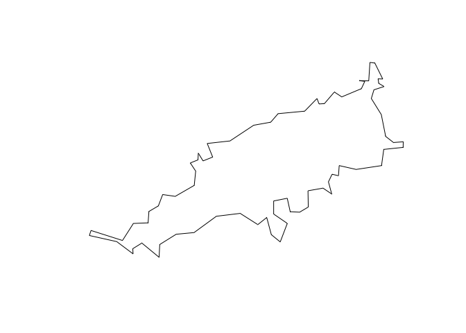
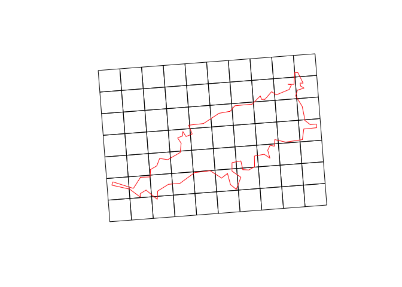

<!-- README.md is generated from README.Rmd. Please edit that file -->

# gridbr: IBGE statistical grid access with R

<!-- badges: start -->

[](https://github.com/luisfelipebr/gridbr/actions/workflows/R-CMD-check.yaml)
<!-- badges: end -->

**The goal of ‘gridbr’ is to provide easy access to [IBGE Statistical
Grid](https://mapasinterativos.ibge.gov.br/grade/default.html)**
(download available
[here](https://geoftp.ibge.gov.br/recortes_para_fins_estatisticos/grade_estatistica/censo_2010/)).
It builds upon the development made in the project [IBGE Statistical
Grid in Compact Representation](https://github.com/osm-codes/BR_IBGE)
(short paper available
[here](http://mtc-m16c.sid.inpe.br/ibi/8JMKD3MGPDW34P/45U7J5H)).

## Installation

You can install the development version of *gridbr* from this GitHub
repository with `devtools`:

``` r
devtools::install_github("luisfelipebr/gridbr")
```

## Example

``` r
library(gridbr)
library(sf)
```

**gridbr_download** is the main function available in the package. It
builds the geometry of IBGE statistical grid and merge it with 2010
population census data. The user must provide the area of interest (aoi)
as a geospatial [sf](https://r-spatial.github.io/sf/index.html) object.

In the following example, the Brazilian archipelago [Fernando de
Noronha](https://en.wikipedia.org/wiki/Fernando_de_Noronha) is used as
aoi. It can be download in one line with the package
[geobr](https://ipeagit.github.io/geobr/) just by using its IBGE
municipality code.

``` r
library(geobr)
```

``` r
aoi <- read_municipality(2605459, showProgress = FALSE)
```

``` r
plot(st_geometry(aoi))
```



After loading the aoi, you can use the function `gridbr_download` to
download the grid. Two arguments are mandatory: `input` and `cellsize`.

``` r
aoi_grid <- gridbr_download(input = aoi, 
                            cellsize = "1KM")
```

``` r
head(aoi_grid)
#> Simple feature collection with 6 features and 5 fields
#> Geometry type: POLYGON
#> Dimension:     XY
#> Bounding box:  xmin: -32.48123 ymin: -3.890802 xmax: -32.46804 ymax: -3.836282
#> Geodetic CRS:  SIRGAS 2000
#>               id MASC FEM POP DOM_OCU                       geometry
#> 1 1KME7376N10816    0   0   0       0 POLYGON ((-32.47706 -3.8908...
#> 2 1KME7376N10817    0   0   0       0 POLYGON ((-32.47775 -3.8818...
#> 3 1KME7376N10818    0   0   0       0 POLYGON ((-32.47845 -3.8728...
#> 4 1KME7376N10819    0   0   0       0 POLYGON ((-32.47914 -3.8638...
#> 5 1KME7376N10820    0   0   0       0 POLYGON ((-32.47984 -3.8549...
#> 6 1KME7376N10821    0   0   0       0 POLYGON ((-32.48054 -3.8459...
```

``` r
plot(st_geometry(aoi_grid))
plot(st_geometry(aoi), add = TRUE, border = "red")
```



The IBGE statistical grid was made available in the following sizes:
500KM, 100KM, 50KM, 10KM, 5KM, 1KM and 200M. Using a different value
will result in an error.

Retrieving population census data requires either an internet connection
or the support package
[gridbr.data](https://github.com/luisfelipebr/gridbr.data). If the user
does not meet these requirements, the output will include only the
cell’s id and geometry, but not population census data. If the user meet
the requirements and still don’t want to download the data, they can
specify it by setting the `census_data` parameter to FALSE.

``` r
aoi_grid <- gridbr_download(aoi,
                            cellsize = "1KM",
                            census_data = FALSE)
```

``` r
head(aoi_grid)
#> Simple feature collection with 6 features and 1 field
#> Geometry type: POLYGON
#> Dimension:     XY
#> Bounding box:  xmin: -32.47775 ymin: -3.890802 xmax: -32.42292 ymax: -3.877677
#> Geodetic CRS:  SIRGAS 2000
#>               id                           geom
#> 1 1KME7376N10816 POLYGON ((-32.47706 -3.8908...
#> 2 1KME7377N10816 POLYGON ((-32.46804 -3.8901...
#> 3 1KME7378N10816 POLYGON ((-32.45901 -3.8894...
#> 4 1KME7379N10816 POLYGON ((-32.44999 -3.8887...
#> 5 1KME7380N10816 POLYGON ((-32.44097 -3.8880...
#> 6 1KME7381N10816 POLYGON ((-32.43194 -3.8873...
```

The other optional parameter is related to the projection: by default,
the output will have the same CRS as the input. If you want to keep the
original grid CRS, with an equal area projection, you must set the
`equal_area` parameter to TRUE.

``` r
aoi_grid <- gridbr_download(aoi,
                            cellsize = "1KM",
                            equal_area = TRUE)
```

``` r
head(aoi_grid)
#> Simple feature collection with 6 features and 5 fields
#> Geometry type: POLYGON
#> Dimension:     XY
#> Bounding box:  xmin: 7376000 ymin: 10816000 xmax: 7377000 ymax: 10822000
#> CRS:           +proj=aea +lat_0=-12 +lon_0=-54 +lat_1=-2 +lat_2=-22 +x_0=5000000 +y_0=10000000 +ellps=GRS80 +units=m +no_defs
#>               id MASC FEM POP DOM_OCU                       geometry
#> 1 1KME7376N10816    0   0   0       0 POLYGON ((7376000 10816000,...
#> 2 1KME7376N10817    0   0   0       0 POLYGON ((7376000 10817000,...
#> 3 1KME7376N10818    0   0   0       0 POLYGON ((7376000 10818000,...
#> 4 1KME7376N10819    0   0   0       0 POLYGON ((7376000 10819000,...
#> 5 1KME7376N10820    0   0   0       0 POLYGON ((7376000 10820000,...
#> 6 1KME7376N10821    0   0   0       0 POLYGON ((7376000 10821000,...
```
